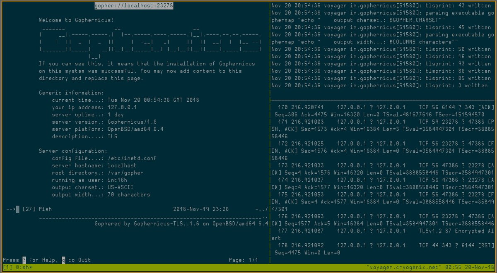
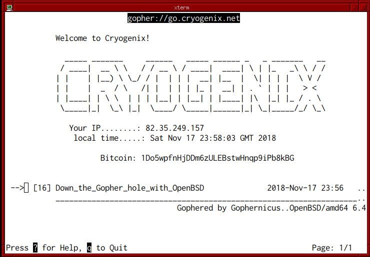
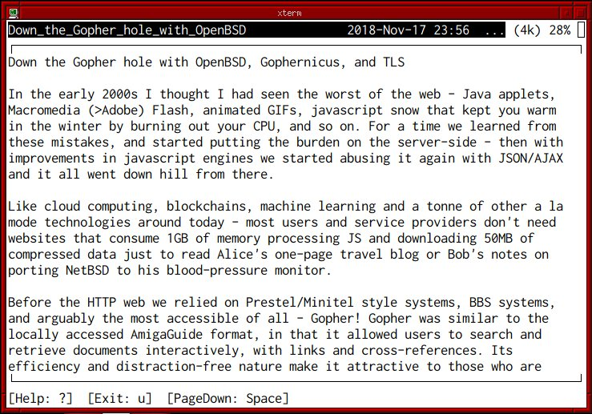
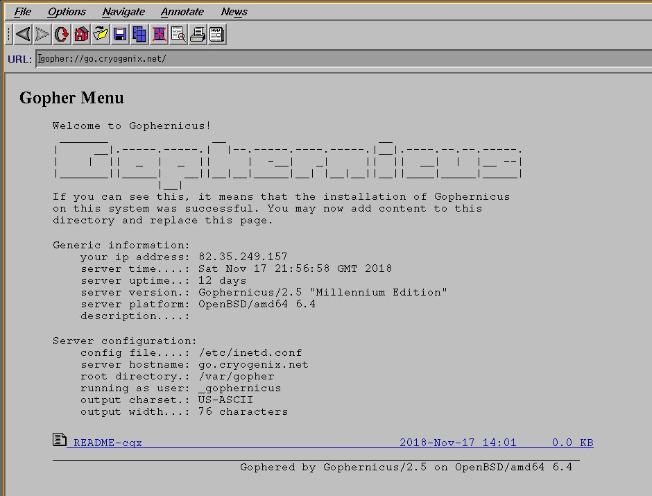

#### Down the Gopher hole with OpenBSD, Gophernicus, and TLS

**UPDATE: I've added TLS support to Gophernicus so you don't need to use stunnel anymore. The code is ugly and unpolished though so I wouldn't recommend for production use.** 

- [https://github.com/0x16h/gophernicus](https://github.com/0x16h/gophernicus)
- [INSTALL.openbsd](https://github.com/0x16h/gophernicus/blob/master/INSTALL.openbsd)

In the early 2000s I thought I had seen the worst of the web - Java applets, Macromedia (>Adobe) Flash, animated GIFs, javascript snow that kept you warm in the winter by burning out your CPU, and so on.  For a time we learned from these mistakes, and started putting the burden on the server-side - then with improvements in javascript engines we started abusing it again with JSON/AJAX and it all went down hill from there.

Like cloud computing, blockchains, machine learning and a tonne of other a la mode technologies around today - most users and service providers don't need websites that consume 1GB of memory processing JS and downloading 50MB of compressed data just to read Alice's one-page travel blog or Bob's notes on porting NetBSD to his blood-pressure monitor.

Before the HTTP web we relied on Prestel/Minitel style systems, BBS systems, and arguably the most accessible of all - Gopher! Gopher was similar to the locally accessed AmigaGuide format, in that it allowed users to search and retrieve documents interactively, with links and cross-references. Its efficiency and distraction-free nature make it attractive to those who are tired of the invasive, clickbait, ad-filled, javascript-laden web2/3.x. But enough complaining and evangelism - here's how to get your own Gopher Hole!

Gophernicus is a modern gopher daemon which aims to be secure (although it still uses inetd -_-); it's even in OpenBSD ports so at least we can rely on it to be reasonably audited. Let's install that and also an ncurses-based gopher client (or lynx(1)) to test things out later:

    $ doas pkg_add gophernicus gopher

If you plan on offering Gopher over TLS:

    $ doas pkg_add stunnel

Instruct inetd(8) how to handle gopher connections (defaults to port 70 TCP) by adding this to /etc/inetd.conf

    gopher stream tcp nowait _gophernicus /usr/local/libexec/in.gophernicus in.gophernicus -h go.cryogenix.net

- Replace go.cryogenix.net with your FQDN. 
- Add **-T 343** if you plan on using TLS on port 343 (IANA has no port allocated for Gopher over TLS but 343 is unassigned and I came across a post with someone mentioning it as a possibility).

See **/usr/local/share/doc/gophernicus/README** for a full listing of command-line arguments and usage options; Gophernicus is feature-rich so it's recommended you RTFM carefully.

If you are using TLS, add a [gophernicus] service to /etc/stunnel/stunnel.conf. For the cert and key, I just added an alternative name for my domain in /etc/acme-client.conf, moved the old cert and ran **acme-client -vFAD cryogenix.net** to update my Let's Encrypt cert:

    [gophernicus]
    cert = /etc/ssl/cryogenix.net.crt
    key = /etc/ssl/private/cryogenix.net.key
    accept = 343
    connect = 127.0.0.1:70
    protocol = proxy
    
Create a directory for our virtual host's gopher hole and copy the default 'index' to it so we can test it:

    $ doas mkdir /var/gopher/go.cryogenix.net
    $ doas cp /var/gopher/gophermap /var/gopher/go.cryogenix.net/

Enable and start inetd (and optionally stunnel):

    $ rcctl enable inetd
    $ rcctl start inetd
    
    $ rcctl enable stunnel
    $ rcctl start stunnel

If you had no errors, you should now be able to use gopher(1) to connect to your server - either by hostname [and optional port] or gopher:// url.

    $ gopher gopher://go.cryogenix.net

If you used stunnel(1) to TLSify Gophernicus, one way you can connect with gopher(1) over TLS on port 343 is by using stunnel(1) on the client or socat(1):

    $ pkg_add stunnel

Add the following to /etc/stunnel/stunnel.conf:

    [gophers]
    client = yes
    accept = 127.0.0.1:10343
    connect = <hostname>:343
    CApath = /etc/ssl/cert.pem

Then start stunnel with rcctl and connect gopher to 127.0.0.1:10343.

Alternatively, with socat:
 
    $ doas pkg_add socat
    $ socat TCP4-LISTEN:10070 openssl-connect:go.cryogenix.net:343,cafile=/etc/ssl/cert.pem,method=TLS1.2,verify=0,reuseaddr &
    $ gopher gopher://localhost:10070

##### Caveats #####

- when connecting to stunnel, libressl returns error 21 (unable to verify first cert) - however the same cert returns no error on port 443 (httpd(8)).
- socat(1) will die when the connection is closed or reaches EOF, which is on every gopher request. Normally we would add the 'fork' option to the end of the openssl-connect command but for some reason it causes gopher(1) to become a runaway process and eat up CPU time.

If you need a starting point with Gopher, SDF-EU's wiki has a good article [here](https://sdfeu.org/w/tutorials:gopher).

Finally, if you don't like gopher(1) - there's always lynx(1) or [NCSA Mosaic](https://cryogenix.net/NCSA_Mosaic_OpenBSD.html)!

