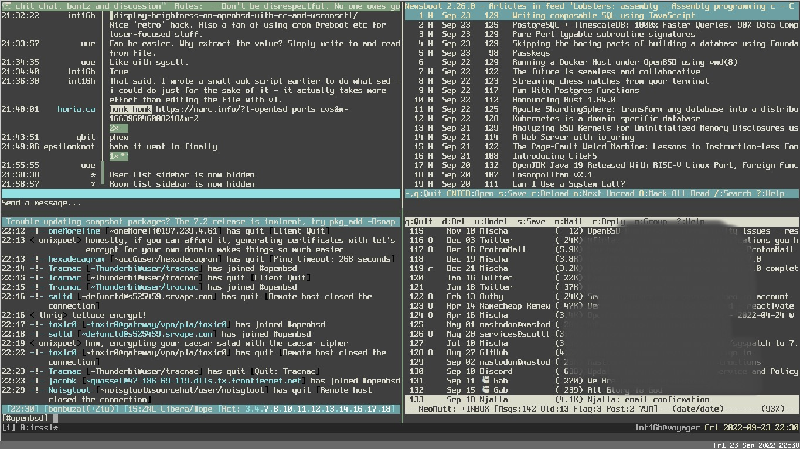

## OpenBSD Minimalist Desktop

It has been a few years since I last wrote about OpenBSD on the desktop (or laptop), and support for modern hardware has continued to improve.  In fact, I even run OpenBSD on an Apple Macbook Pro M1/Silicon now!

I was going to update the previous article but as my own habits have changed quite a lot and are more in line with the spirit of the OpenBSD base it seemed like a new article was warranted. I may update this article in the future with 'rice' for cwm(1) (including Xresources, etc) but at present this is a basic guide to getting a generic desktop system up and running. 

It is customary when mentioning any command, file, or topic that has a manual page to include which manual it's included in.  So when you see `cwm(1)` - I am referring to cwm in the General Commands manual, which is manual 1.  To read that manual page, type: man 1 cwm (though `man cwm` will default to cwm(1)).
 
Hardware: Lenovo Thinkpad X280 (8GB RAM / 256GB NVMe / Intel Wifi)

Grab install71.img from https://cdn.openbsd.org/pub/OpenBSD/7.1/amd64/ and write it to a USB flash disk. On a Unix-like operating system dd can be used to accomplish this:

    dd if=install71.img of=/dev/sdb bs=1M conv=fsync
    

When installing OpenBSD I always use softraid(8) CRYPTO to encrypt my system.  Instructions to do this are in the [OpenBSD FAQ](https://openbsd.org/faq/faq14.html#softraidFDE).

The default disklabel(8) layout is recommended for most situations, however, if you will be compiling a lot of ports you may want to edit the default layout to make more space in /usr/src and /usr/obj; here is what I ended up with:

    OpenBSD area: 1024-500116574; size: 238.5G; free: 0.0G
    #                size           offset  fstype [fsize bsize   cpg]
      a:             1.0G             1024  4.2BSD   2048 16384 12960 # /
      b:             8.1G          2098176    swap                    # none
      c:           238.5G                0  unused                    
      d:            16.0G         19086080  4.2BSD   2048 16384 12960 # /tmp
      e:            20.0G         52644992  4.2BSD   2048 16384 12960 # /var
      f:            10.0G         94590720  4.2BSD   2048 16384 12960 # /usr
      g:             4.0G        115571584  4.2BSD   2048 16384 12960 # /usr/X11R6
      h:            30.0G        123973600  4.2BSD   2048 16384 12960 # /usr/local
      i:             0.0G               64   MSDOS                    
      j:            12.0G        186900192  4.2BSD   2048 16384 12960 # /usr/src
      k:            16.0G        212074048  4.2BSD   2048 16384 12960 # /usr/obj
      l:           121.3G        245633824  4.2BSD   2048 16384 12960 # /home
    

### Firmware and networking ###

OpenBSD detects the iwm(8) 802.11x wireless device but will need the firmware for it to be functional. If you have a supported USB sup
ported adapter or Lenovo's adapter cable for the built-in em(8) ethernet device you can skip the following step as OpenBSD will run fw
_update(8) if you configure your ethernet adapter correctly.

On another computer with network access, format a USB disk as FAT and copy everything from http://firmware.openbsd.org/firmware/7.2/ onto it. I find the easiest way to grab these files on a non-OpenBSD system is to install and use lftp:

    $ lftp http://firmware.openbsd.org/firmware/7.2/
    cd ok, cwd=/firmware/7.2
    lftp firmware.openbsd.org:/firmware/7.2> mget * 
   
Unmount the disk and keep it for later.

### First boot ###

#### Firmware ####

Insert your USB key with the firmware, mount it, copy the firmware over and install it:

    # dmesg | grep sd
    # mount_msdos /dev/sd3i /mnt
    # mkdir /home/firmware
    # cp /mnt/firmware/* /home/firmware/
    # mv /home/firmware/SHA256.SIG /home/firmware/SHA256.sig
    # fw_update -p /home/firmware/

#### Connecting to Wifi ####

If you skipped setting up wifi during installation, you can do so now by editing hostname.if(5), where `if` is your wifi interface. Running ifconfig(8) can help you identify the interface. For Intel 7000-9000 based cards such as on this Thinkpad, the device is iwm0.

/etc/hostname.iwm0:

    join somewifinet wpakey mywpapassphrase
    inet autoconf

That's it. When you next reboot it will connect automatically.  If you ever need to manually reset your network interfaces and bring them back up, see netstart(8). For example:
 
    sh /etc/netstart iwm0
    

#### Performance ####

It is recommended to disable the updating of atime (access time) on filesystems with heavy usage such as laptops or NNTP servers where disk performance is more important than maintaining accurate file access times. 

For user data (/home), we can increase performance by using the softdep (soft dependencies) mount option which prevents filesystem metadata from being written immediately. This isn't recommended for critical filesystem mountpoints where it can cause problems but for user data it is generally safe.

See mount(8).

    # fstab=${mktemp}
    # cp /etc/fstab "$fstab" &&
       cat $fstab | awk '/rw/ {sub(/rw/,"rw,noatime")}1'
       | awk '/home/ {sub(/noatime/,"noatime,softdep")}1' > /etc/fstab

The resulting `/etc/fstab` file should look something like the following:

    e123eac9a466a7c7.b none swap sw
    e123eac9a466a7c7.a / ffs rw,noatime 1 1
    e123eac9a466a7c7.l /home ffs rw,noatime,softdep,nodev,nosuid 1 2
    e123eac9a466a7c7.d /tmp ffs rw,noatime,nodev,nosuid 1 2
    e123eac9a466a7c7.f /usr ffs rw,noatime,nodev 1 2
    e123eac9a466a7c7.g /usr/X11R6 ffs rw,noatime,nodev 1 2
    e123eac9a466a7c7.h /usr/local ffs rw,noatime,wxallowed,nodev 1 2
    e123eac9a466a7c7.k /usr/obj ffs rw,noatime,nodev,nosuid 1 2
    e123eac9a466a7c7.j /usr/src ffs rw,noatime,nodev,nosuid 1 2
    e123eac9a466a7c7.e /var ffs rw,noatime,nodev,nosuid 1 2
    

It is also desirable, especially on a laptop, to have the Advanced Power Management daemon running in automatic mode.

    # rcctl enable apmd
    # rcctl set apmd flags -A

One side effect of this on some systems is that the CPU will run at full speed when connected to AC and at its lowest speed when on battery.  One workaround is to use the -L flag (manual mode, hw.setperf=0) then use something like [obsdfreqd](https://tildegit.org/solene/obsdfreqd) - which facilitates userland CPU frequency scheduling. 

#### Xenocara / xenodm(1) ####

Xenocara is OpenBSD's infrastructure for the X(7).org Server and window managers included in base - cwm(1) and fvwm(1).

xenodm(1) is the X(1) Display Manager which manages access to the Xserver(1), providing a graphical login interface.

By default, xconsole(1) is started by xenodm(1) and the background set to the familiar (and perhaps ugly) root weave pattern.  We can easily remove these in /etc/X11/xenodm/Xsetup_0, have the background set to a solid dark grey colour and disable the system bell:

    # sed -i '/${exec/s/^/#/g' /etc/X11/xenodm/Xsetup_0
    # PREF="\${exec_prefix}/bin" &&
        echo "$PREF/xsetroot -solid dimgrey\n$PREF/xset b off\n" >> /etc/X11/xenodm/Xsetup_0

#### Add your user to staff and doas.conf(5) ####

It's not recommended to normally login as the root user. For a long time, Unix-like operating systems relied on `sudo` to perform operations as another user (such as root); in 2015 Ted Unangst developed doas(1) for OpenBSD as a safer and simpler replacement.

Let's allow any user in the wheel group(5) to execute commands as root with doas(1):

    # echo "permit :wheel" >> /etc/doas.conf

In addition to groups such as wheel, OpenBSD (like other BSD operating systems) maintains a login class capability database that is configured in login.conf(5).  This allows fine-tuning of resources for users and processes in a robust yet simple way. On a desktop or laptop, the user we created is probably going to be our only human user so we should add it to the staff class and increase resources to ensure we can use the system as a daily driver:

    # usermod -L staff myuser
    # usermod -G staff myuser

In `/etc/login.conf' update the staff class as follows using vi(1):

    staff:\
        :datasize-cur=4096M:\
        :datasize-max=infinity:\
        :maxproc-max=512:\
        :maxproc-cur=256:\
        :openfiles-cur=4096:\
        :openfiles-max=4096:\
	:ignorenologin:\
	:requirehome@:\
	:tc=default:
     
    
You should increase datasize-cur depending on your total memory. 4096M works relatively well for 8GB though I have noticed with excessive web browser use that things can freeze up.  Likewise, openfiles-cur/max should be increased depending on your needs.  If you run Syncthing or work with large Bittorrent files for example you will probably want to increase that to an insane amount and replicate it in /etc/sysctl.conf(5): kern.maxfiles.

Rebuild the database:

    [ -f /etc/login.conf.db ] && cap_mkdb /etc/login.conf
    

#### Kernel settings ####

Here are some recommended values (based on this system) for a desktop to add to /etc/sysctl.conf(5):

    cat <<EOF > /etc/sysctl.conf
    # Shared memory
    kern.shminfo.shmall=3145728
    kern.shminfo.shmmax=2147483647
    kern.shminfo.shmmni=1024
    kern.shminfo.shmseg=1024

    # Semaphores
    kern.seminfo.semmns=4096
    kern.seminfo.semmni=1024

    kern.maxproc=32768
    kern.maxthread=4096
    kern.maxfiles=65535
    kern.bufcachepercent=90
    kern.maxvnodes=262144
    kern.somaxconn=2048
    EOF
    
#### X Session

To enable tap-to-click on the trackpad:

    # echo "mouse.tp.tapping=1" >> /etc/wsconsctl.conf

Now exit then login as your regular user and create `.xsession` in your home directory with the following:

    # Set your locale(1)
    export LANG=en_US.UTF-8
    
    # Set your environment (korn shell) 
    export ENV=$HOME/.kshrc
    
    # No core dumps! 
    ulimit -Sc 0 
    
    # Merge our X resources
    xrdb -merge $HOME/.Xresources
    
    # Set background colour 
    setroot -solid dimgrey

    # Make sure that bell is off! 
    xset b off
    
    # Use Capslock as CTRL 
    setxkbmap -option ctrl:nocaps
    
    # Run xterm 
    xterm &
    
    # Fix scaling of some X/QT programs 
    xrandr --dpi 96
    
    # Automatically lock X 
    xidle -delay 5 -sw -timeout 300 -program "/usr/X11R6/bin/xlock -mode qix" &
    
    # Run our window manager.
    # Can later be replaced with `exec startxfce4` if desired.
    # exec runs it in the foreground - X will exit when the cwm proc exits.
    exec cwm 
    

At this point we should `reboot(8)` - then we can benefit from our disk performance tweaks which you will be thankful for when installing packages.

### Second boot

If you didn't make any typos, you should be greeted by xenodm(1) again and able to login as your normal staff user before being presented with a terminal.

Hopefully the network will be up now too, in which case we should update the system using syspatch(8) and reboot again:

    $ doas syspatch
    $ doas reboot

#### Customisation ####

Let's install some packages, adjusting to your own taste:

    $ doas pkg_add ImageMagick \
                bzip2 \
		git \
		gnupg \
		firefox \
		iridium \
		w3m \
		mpv \
		inconsolata-font \
		spleen \
	 	ffmpeg \
		unzip \
		keepassxc \
		weechat \
		picom \	
   		mupdf \
		newsboat \
		neomutt \
		vim

If you would prefer a more familiar desktop environment, xfce can be installed:

    $ doas pkg_add xfce xfce-extras xfce4-power-manager upower xscreensaver

Then in .xsession, replace `exec cwm` with `exec startxfce4` and remove the xidle and xterm lines. 

If you are not using xfce, then you will need to enable messagebus/dbus with:

    $ doas rcctl enable messagebus

or by adding the following to .xsession:

    if [ -x /usr/local/bin/dbus-launch -a -z "${DBUS_SSEEION_BUS_ADDRESS}" ]; then
      eval `dbus-launch --sh-syntax --exit-with-x11`
    fi
    

#### Xresources ####

You could write a book, or at least a pamphlet, on styling X(7).  Callum Smith has some more complete configs, but the following ~/.Xresources file will at least get you started with a less-ugly xterm to use in cwm(1):

    *visualBell: True 
    xterm.loginShell: true 
    xterm*faceName: Inconsolata:size=16
    xterm*dynamicColors: true
    xterm*utf8: 2
    xterm*eightBitInput: true
    xterm*scrollBar: false
    xterm*foreground: rgb:a8/a8/a8
    xterm*background: rgb:00/00/00

#### cwmrc(5) ####

A minimal ~/.cwmrc configuration:

    fontname "Inconsolata:pixelsize=14:bold"
    sticky yes
    snapdist                20

    command firefox         firefox
    command newsboat        newsboat
    command keepassxc       keepassxc 

    bind-key 4-Return       terminal
    bind-key CM-Return      "xterm -e top"
    bind-key C4-equal       window-vmaximize
    bind-key C4S-equal      window-hmaximize
    bind-key 4-1           group-only-1
    bind-key 4-2           group-only-2
    bind-key 4-3           group-only-3
    bind-key C4-1          window-movetogroup-1
    bind-key C4-2          window-movetogroup-2
    bind-key C4-3          window-movetogroup-3
    bind-key M-j            window-cycle
    bind-key M-k            window-cycle
    bind-key M-t            window-maximize
    bind-key M-v            window-vtile

    bind-key 4-b            "xbacklight -dec 10 -time 0"
    bind-key 4S-b           "xbacklight -inc 10 -time 0"
    
cwm(1) can take some getting used to if you are more accustomed to a traditional desktop environment but with a little effort to learn to use it efficiently you will find it increases your productivity and decreases your dependence on the mouse or trackpad.

In the above example, pressing WINDOWS+Return will spawn a terminal. 

#### Miscellaneous

If you have performance issues in Firefox, in the navigation bar type: about:config *enter* then search for and enable this option:

    layers.acceleration.force-enable=true

