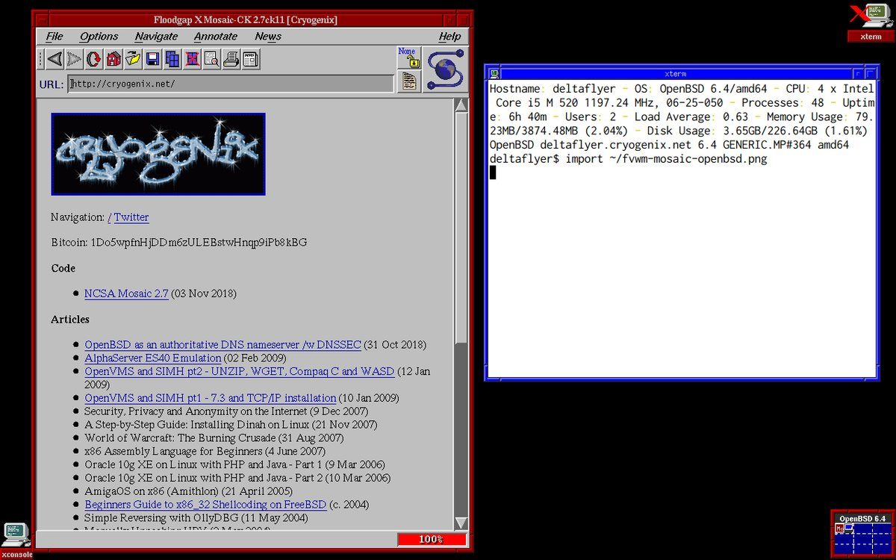
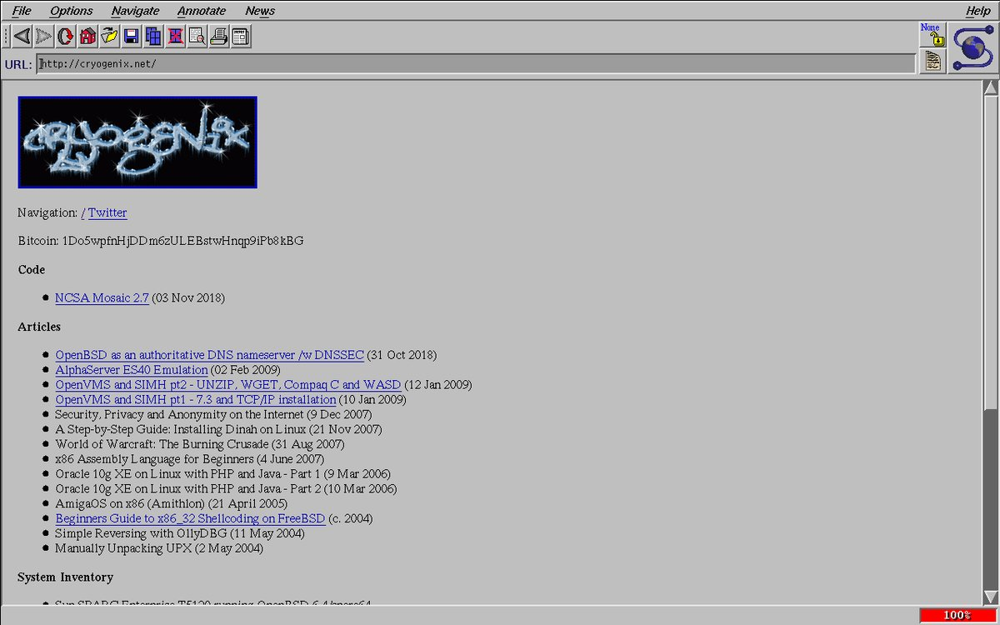

#### NCSA Mosaic 2.7 on OpenBSD
A classic web browser, now available on OpenBSD

Added OpenBSD support and upgraded the archaic libpng code so you too can enjoy this historic web browser. NCSA's site causes a coredump, so run the binary with another URL as an argument. It's not great as a browser on the modern web, but it does make a great gopher client!

Now using Cameron Kaiser's patches and alternative ('modern') renderer.  This needs a serious code audit before even considering submitting to ports.

    $ git clone https://github.com/0x16h/mosaic-CK-openbsd
    $ doas pkg_add motif
    $ cd mosaic-CK-openbsd && make openbsd
    $ src/Mosaic gopher://gopher.club

